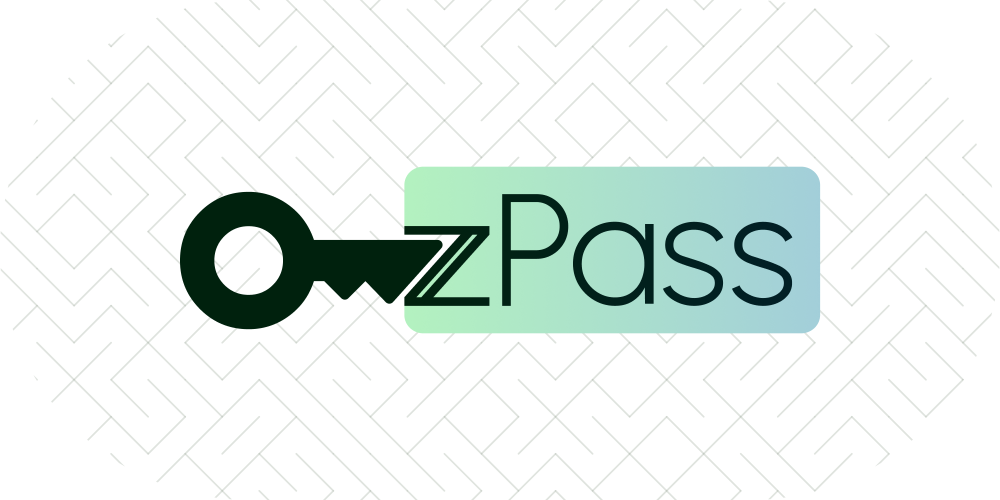
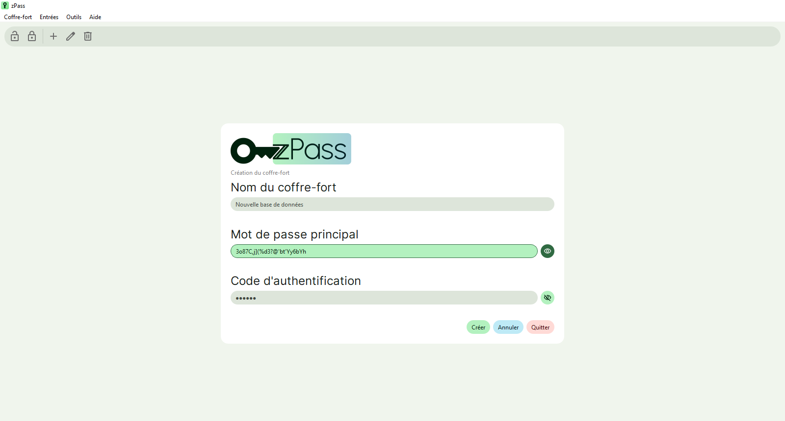
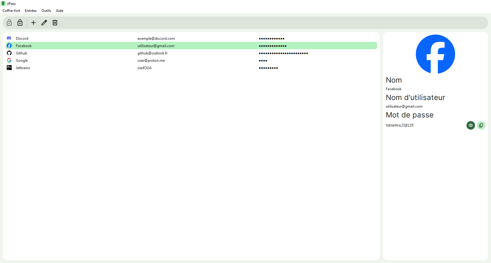

<h1 align="center">zPass (NSI)</h1>

<div align="center">
  <p>Projet d'NSI : Gestionnaire de mots de passe hors-ligne</p>
  
  
  
  
  
</div>

<br>

# Cahier des charges

Le but du projet était de créer un gestionnaire de mots de passe, hors-ligne.<br>
Les technologies utilisées seront le langage Python (développé avec la version 3.12.2) ainsi que le module PySide6, qui servira à réaliser l'interface utilisateur.<br>
Le projet se nommera "zPass".

## 0. Choix du module d'interface

Le choix du module a été guidé par le fait qu'un module utilisant la technologie Qt permettait de créer des interfaces flexibles et cohérentes entre les différentes plateformes (principalement Windows et Linux). De plus, Qt  a tendance à être beaucoup plus rapide et optimisé que Tkinter (Qt utilise le C++).<br>
Deux options s'offrent à nous : le module [PyQt](https://www.riverbankcomputing.com/software/pyqt/) et [PySide](https://pypi.org/project/PySide/).<br>

Les modules sont analogues, et partagent les mêmes fonctions (ou presque), ce qui rend la documentation facile à trouver. PySide a été choisi car le module est disponible uniquement sous licence LGPL, tandis que PyQt (appartenant à Riverbank Computing) est disponible soit sous licence GPLv3, soit sous leur propre licence commerciale (si le code source du programme concerné n'est pas mis à disposition).<br>
Un module comme PySide permet l'usage de propriétés CSS pour styliser les éléments graphiques.

## 1. Recherches initiales

### 1.1. Logiciels existants

Le logiciel libre [KeePassXC](https://keepassxc.org/) est un excellent exemple à prendre, car il est similaire à ce que nous souhaitons achever.

<div align="center">
  
  <p><i>Interface du logiciel KeePassXC</i></p>
</div>

### 1.2. Chiffrement de la base de données

De par la nature de zPass, les mots de passe devront être stockés d'une façon ou d'une autre. Nous pourrions ne les stocker que dans un simple fichier .txt sans chiffrement, au risque de poser un sérieux risque. Il faudra donc les chiffrer, avec des méthodes adaptées.<br>

La phase de recherches incluait un volet sur le chiffrement, et le type de chiffrement qui ressortait le plus (pour des données aussi sensibles que des mots de passe) était de chiffrement AES, Advanced Encryption Standard.<br>
Il s'agit de l'algorithme de chiffrement idéal, car il est "symétrique", il demande donc une même clé (dans notre cas un mot de passe principal) pour chiffrer et déchiffrer l'information.

## 2. Structures de données

### 2.1. Base de données

La base de données, appelée "coffre-fort" dans zPass, est un fichier .json chiffré avec la méthode décrite ci-dessus dont l'extension a été remplacée par ".zpdb" (zPass Database), pour dissuader Windows de proposer un éditeur de texte pour ouvrir le fichier.<br>
```json
{
    "entries": { // Le dictionnaire "entries" contient toutes les entrées
        "Facebook": { // Chaque entrée est un dictionnaire en elle-même
            "icon_path": "./icons/5463088114.png", // Chemin vers l'icône
            "name": "Facebook", // Nom de l'entrée
            "password": "mot de passe", // Mot de passe
            "username": "compte@proton.me" // Nom d'utilisateur
        }
    },
    "vault_name": "Base de données" // Nom du coffre-fort
}
```
Chiffré en utilisant un mot de passe et un code d'authentification grâce à la méthode AES, le fichier .json ci-dessus devient :
```
�(խ+q�^Vj��'�?B��#tT� �}��Z����yst�$K�RNY;)6ʈ�I��6��4fp}^gm����~��?�k��Q�nN`P%*�Ya��zi5�O���r9R�����Qv�t%�hM�i�".b�����S��p<X]��~|�6�[���sq�z]�>�^�SPFl}�z���g�t" ����I ��l�C4mF�Q>7H�NbEtig���$�`ptߋS�(ŀ�O�
����E��`�u�VG��+]��
```
Grâce au module `json` de Python, on peut charger un fichier sous format JSON pour l'interpréter comme un dictionnaire. On pourra accéder au nom d'utilisateur de l'entrée "Facebook" grâce à :
```python
encrypted_vault = open('./vaults/Base de données.zpdb', 'r').read() # On charge les données du coffre-fort chiffré
decrypted_vault = decrypt(encrypted_vault) # On déchiffre le coffre-fort et on obtient un dictionnaire avec json.load()
facebook_username = decrypted_vault['entries']['Facebook']['username'] # La variable "facebook_username" contient maintenant le nom d'utilisateur
```

### 2.2. Mot de passe et code d'authentification

Le module utilisé pour le chiffrement AES sur Python requiert des identifiants de type `bytes`. Le mot de passe principal doit aussi être une puissance de 2 supérieure à 16.<br>
Le code d'authentification dans zPass est un code contenant 6 chiffres, similaire à un code utilisé dans de l'identification à deux facteurs (exemple : `123456`)

La procédure de déchiffrement est donc la suivante :
- Initialiser une variable qui pourra stocker le dernier mot de passe principal valide
- Idem pour le code d'authentification
- Récupérer la saisie de l'utilisateur
    - Vérifier que la longueur du mot de passe principal est supérieure à 0
    - Vérifier que le code d'authentification respecte les contraintes définies
- Envoyer à la fonction de déchiffrement les identifiants
    - Le mot de passe principal, avec une longueur ajustée vers la prochaine puissance de 2 sous format `bytes`
    - Le code d'authentification sous format `bytes`

La même chose est réalisée pour la fonction qui chiffre la base de données.

### 2.3. Fichier paramètres

Le fichier paramètres est un fichier JSON qui contient, outre des paramètres comme "use_dark_theme", la liste des bases de données ainsi que leur emplacement :
```json
{
    "use_dark_theme": false,
    // Autres paramètres
    "vaults": {
        "Base de données": {
            "file_path": "vaults/Base de données.zpdb"
        },
        "Coffre": {
            "file_path": "vaults/Coffre.zpdb"
        }
    }
}
```

## 3. Interface graphique

### 3.1. Menu de déchiffrement


### 3.2. Menu de création de base de données



### 3.3. Menu d'affichage des entrées



À gauche : liste des entrées, à droite : informations sur l'entrée sélectionnée

#### 3.3.1. Nouvelle entrée


#### 3.3.2. Modification d'une entrée existante


## 4. Bilan

Ce projet est finalisé dans l'ensemble, et permet la création et la gestion de bases de données de mots de passe.

### 4.1. Limitations

Faute de temps, certaines fonctionnalités n'ont pas pu être implémentées :
- **Le menu paramètres** : Le fichier paramètres `settings.json` est bien présent, et est utilisé pour stocker les chemins des différents coffres-forts, cependant, l'interface de changement des paramètres, située dans Outils > Paramètres n'a pas pu être ajoutée à temps.
    - Par conséquent, le **mode sombre** ne peut pas être activé. Il reste en effet inachevé.
- **Le générateur de mots de passe** : Ce menu aurait pu permettre de générer des mots de passe directement lors de la création d'une entrée.
- **Accessibilité** : L'accessibilité du programme laisse à désirer. Il est possible de naviguer dans le programme en utilisant la touche *Tab*, cependant, aucun indice visuel n'est présent.
    - Ceci est causé par la propriété CSS suivante : ` * {outline: none;}`. Il faudrait donc réimplémenter une façon de montrer qu'un bouton est en `:focus` qui corresponde au design général de zPass.

### 4.2. Pistes supplémentaires

- La façon dont les données déchiffrées sont gérées, grâce au fichier temporaire `.temp_vault.zpdb`, est loin d'être la meilleure manière de procéder : il s'agit en effet d'un risque de sécurité, car les mots de passe sont stockés, jusqu'à être chiffrés, en *plain text* (texte brut). De plus, le simple fait de supprimer ce fichier temporaire ne réduit en aucun cas les chances qu'un acteur malveillant récupère les mots de passe : un fichier supprimé n'est jamais vraiment effacé, et ce jusqu'à ce que d'autres données l'écrase.
    - Il faudrait donc gérer le tout sans écrire quoique ce soit au disque dur. Utiliser un fichier temporaire à permis entre autres de vérifier que tout se passait bien.
- Il serait intéressant de créer une version totalement dans la console de zPass, résiliente et fiable.

## 5. Notes supplémentaires

### 5.1. Limite du nom de base de données

Il s'agit d'une limite arbitraire que je me suis permis d'instaurer. La raison est la suivante : la longueur maximale d'un chemin pour un fichier est définie par la clé de registre "MAX_PATH" sur Windows, et est limitée à 256. Cette limite de 32 caractères pour le nom de tout nouveau coffre est là pour éviter tout problème s'y relatant. Dans le cas de Python, et de la fonction "open()", un chemin d'accès trop long génère une *OSError* [Errno 22] sur Windows.